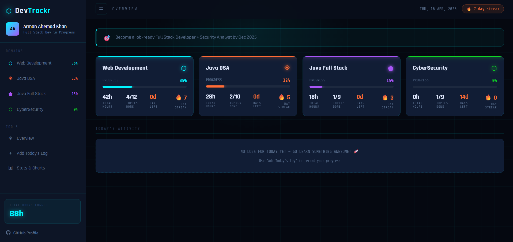

# ⬡ DevTrackr

> A cyberpunk-styled learning progress tracker for developers. Track your journey across Web Development, DSA, Full Stack, CyberSecurity and more.



## 🚀 Features

- **Multi-domain tracking** — Web Dev, Java DSA, Java Full Stack, CyberSecurity
- **Daily learning logs** — date, what you learned, next target, hours, mood
- **Progress meters** — visual progress bars per domain
- **Topic checklists** — tick off skills as you master them
- **Streak tracker** — stay consistent every day
- **Log generator** — fill a form, get code to paste (no backend needed!)
- **Stats dashboard** — total hours, avg progress, breakdowns
- **Cyberpunk dark UI** — looks incredible, runs anywhere

## 📁 Project Structure

```
devtrackr/
├── index.html          ← Main page
├── style.css           ← Cyberpunk theme
├── script.js           ← All logic
├── data/
│   └── progress.js     ← YOUR DAILY DATA (edit this every day!)
└── README.md
```

## 🛠️ How to Use (Phase 1 — Hardcoded)

1. **Clone the repo**
   ```bash
   git clone https://github.com/yourusername/devtrackr
   cd devtrackr
   ```

2. **Edit `data/progress.js`** — update your name, goal, progress % and topics

3. **Add a daily log** — use the "Add Today's Log" form in the app, copy the generated code, paste into `data/progress.js`

4. **Open `index.html`** in your browser (no server needed!)

5. **Push to GitHub every day**
   ```bash
   git add .
   git commit -m "log: Apr 16 - learned CSS Grid"
   git push
   ```

6. **Enable GitHub Pages** — Settings → Pages → main branch → Save
   Your live URL: `https://yourusername.github.io/devtrackr`

## ✏️ Daily Log Workflow

Every evening, open the app → click **Add Today's Log** → fill the form → copy the generated JavaScript → paste it at the top of the relevant domain's `logs` array in `data/progress.js` → update the `progress` percentage → push to GitHub.

That's it. Takes 5 minutes.

## 🔮 Roadmap

| Phase | Status | Description |
|-------|--------|-------------|
| Phase 1 | ✅ Done | Hardcoded HTML/CSS/JS, GitHub Pages |
| Phase 2 | 🔜 Planned | Streak calendar, charts, Pomodoro timer |
| Phase 3 | 🔜 Planned | Full stack, login/register, MongoDB, deployed |

## 🍴 Fork & Use

This project is open source. Fork it, update `data/progress.js` with your own name and learning goals, deploy on GitHub Pages, and start tracking!

---

Built by [@arman080325](https://github.com/arman080325) · MIT License
